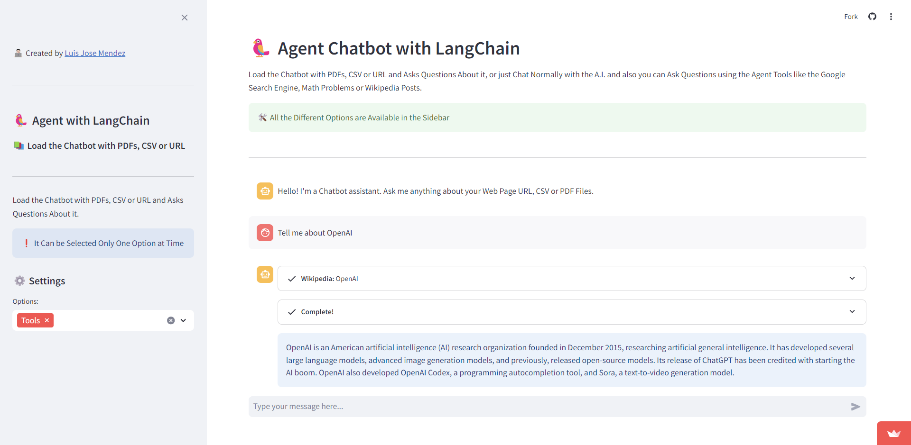

# LangChain Agent App with Llama3, Groq, Streamlit, HugginFace and Gemini-Pro

## LangChain Agent App with Llama3, Groq, Streamlit, HugginFace and Gemini-Pro

The Chatbot can be Loaded with PDFs, CSV or URL and Asks Questions About it, or just Chat Normally with the Llama3 AI Model.

The LangChain Agent has Tools like the Google Search Engine, Math Problems or Wikipedia Posts.

## Preview

- App Preview: https://www.youtube.com/watch?v=A3YX0zpA-VM

## Connect
- Linkedin: https://www.linkedin.com/in/luis-jose-mendez/
- GitHub: https://github.com/mendez-luisjose
